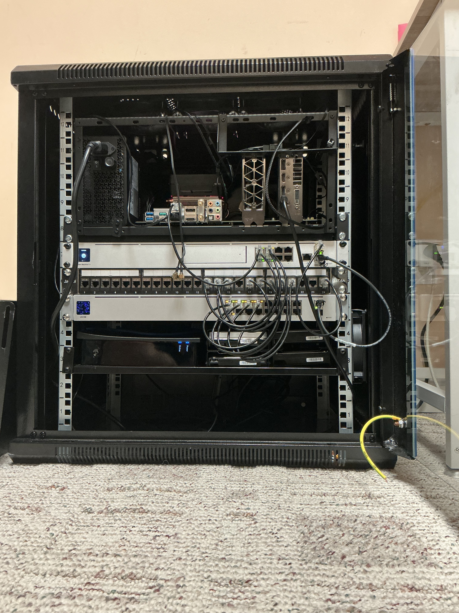

# What ENDOR is (snapshot, not a shopping list)

**Status:** published  
**Lab:** ENDOR  
**Date:** 2026-09-07 (snapshot date; one driver change noted after it)  
**Scope:** inventory of one machine as observed that day  
**Not:** a generic homelab flex, and not a complete parts list

  

<em>Floor rack, door parked to the side. Blower Tesla on the tray is the P100 (no display ports). The card to its right with the DisplayPort cable is a GTX 960 for occasional local outputs.</em>

Other notes in this repo assume a box named ENDOR. This is that box: what I will stand behind, what I will not invent, and what was actually running when I looked.

This is a snapshot of one machine on one day. It is not a build guide, a parts list to copy, or a recommendation.

## Why this note exists

A Wolf Quadlet or an Immich pod is unreadable if you do not know the machine around it.

What I do have:

- A named lab, board, CPU, RAM, and OS point release
- One encode/compute GPU that forces a lot of the architecture, plus a GTX 960 for local video out
- Disk models plus the Btrfs RAID1 + bcache topology
- A runtime policy with one loud exception
- A `podman ps` from 2026-09-07

The photo is the case: a 12U glass-door floor rack, board on an open tray at the top. Current rack PSU label is unread. A power-pull test is still unpublished.

## The claim

**Observed:** ENDOR is hostname `endor`, chassis `desktop`, an ASUS PRIME B550-PLUS AC-HES running Ubuntu 26.04.1 LTS (`Linux 7.0.0-31-generic`). CPU is an AMD Ryzen 7 5800XT (8 cores / 16 threads). About 30 GiB RAM visible, no swap. Podman 5.7.0. NVIDIA host module `580.173.02` on the snapshot date. Most workloads are rootless Podman Quadlets. Wolf and AdGuard Home are rootful. The interesting GPU is a reused Tesla P100 16 GB (`nvidia0`, `/dev/dri/renderD128`). A GTX 960 sits next to it on the same tray and takes a DisplayPort cable when I need a local picture; Wolf, Immich, and Jellyfin do not use that card. Bulk app and photo state sits on Btrfs over bcache (writethrough). Media is a separate 16 TB disk. In front of the host: a UniFi Dream Machine Pro (1 TB HDD) and a USW-16-PoE. The Spectrum handoff lands on the UDM-Pro SFP port through an Ethernet-to-SFP transceiver. DNS on the box is AdGuard Home. Power path is a CyberPower S175UC on NUT, plus wake-on-LAN. Everyday management is Cockpit plus `journalctl`.

**Not claimed:** measured WAN throughput, a pull-the-plug test, or any GPU benchmark. Swap is off on purpose.

## Hardware I will name

| Piece | What I know | Why it matters |
| --- | --- | --- |
| Board | ASUS PRIME B550-PLUS AC-HES, firmware 3621 (2025-01-13) | AM4 desktop board, not a 1U chassis |
| CPU | Ryzen 7 5800XT, 8c/16t | Enough host CPU that Wolf encode is a choice |
| RAM | 30 GiB visible, 0 swap | Swap is disabled so Ubuntu does not wear the NVMe |
| GPU (encode / compute) | Tesla P100 16 GB, nvidia0 / renderD128, module 580.173.02 on the snapshot date | Printed shroud + Wathai 9733, PWM from p100-fan-control.service |
| GPU (local display) | GTX 960, DisplayPort cable visible on the right of the tray | Occasional graphical output. Not the Wolf/Immich/Jellyfin card |
| Case | 12U glass-door rack; board on an open tray at the top | Photo above; same file at [images/endor-rack.jpg](images/endor-rack.jpg) |
| GPU consumers | Wolf (rootful), Immich server + ML via CDI, Jellyfin, Ollama | Those workloads are wired to the P100 |
| OS / runtime | Ubuntu 26.04.1 LTS, kernel 7.0.0-31-generic, Podman 5.7.0 | Immich ML healthcheck quoting broke on this pairing |
| Storage | Btrfs on bcache writethrough; NVMe root; separate media + Time Machine disks | Not ZFS. Not one big pool |
| Network | UDM-Pro (1 TB HDD) + USW-16-PoE; WAN on SFP via Ethernet-to-SFP; AdGuard Home | The SFP port is how the circuit lands, not a 10 Gb flex |
| Power | CyberPower S175UC on NUT, plus WOL | No published pull-the-plug test |
| Console | Cockpit, including cockpit-podman | Same engine the Quadlets use |

Why this card exists: [Why I bought a sub-$100 Tesla P100](why-i-bought-a-tesla-p100.md).

## Runtime model

House style: Ubuntu 26.04.1 LTS, Podman 5.7.0, Quadlets, rootless user units for almost everything.

| Workload | Privilege | Unit type |
| --- | --- | --- |
| Wolf | rootful | system Quadlet |
| AdGuard Home | rootful | system container |
| Everything else below | rootless | user Quadlets |

Why Wolf is the exception: [Why I run Wolf on Podman instead of Docker](why-i-run-wolf-on-podman.md).

## What was running on 2026-09-07

### Rootful

| Name | Role |
| --- | --- |
| Wolf | Moonlight supervisor. Sanitized unit: [configs/wolf/](../configs/wolf/) |
| AdGuard Home | LAN DNS. Technitium is planned, not running |

### Rootless

Uptime Kuma; Scrypted (+ Watchtower); LubeLogger + Postgres; AirTrail DB only; Jellyfin (daily client is Infuse); Ollama; Jellyseerr; Home Assistant; Immich pod ([configs/immich/](../configs/immich/)).

Immich ML is healthy as of later 2026-09-07 after a HealthCmd quoting fix on Podman 5.7.0 / Ubuntu 26.04.1. That is liveness, not an embeddings benchmark.

## Disks

| Device | Size | Model | Role |
| --- | --- | --- | --- |
| nvme0n1 | 931.5 G | CT1000P3SSD8 | EFI + /boot + LVM root ext4 |
| sda | 465.8 G | WDC WDS500G1R0A | bcache cache |
| sdb | 3.6 T | ST4000NE001-2MA1 | bcache0, Btrfs |
| sdc | 3.6 T | ST4000NE001-2MA1 | bcache1, Btrfs (mount source in the dump) |
| sdd | 14.6 T | ST16000NM001G-2K | ext4, media |
| sde | 3.6 T | ST4000VN006-3CW1 | Time Machine splits |

Cache mode is writethrough. The dump listed only bcache1 as the Btrfs mount source. I have not published a `btrfs filesystem show` here, so the RAID1 membership of bcache0 is stated, not shown.

## What broke after the snapshot

One day later, on 2026-09-08, Ubuntu moved the host NVIDIA module from `580.173.02` to `580.178.04`. Wolf stayed up and the stream died, because the driver volume still had the old `libcuda`. The full failure and the fix: [I broke Wolf after an NVIDIA driver update](i-broke-wolf-after-an-nvidia-driver-update.md).

The tables above stay at the 2026-09-07 numbers on purpose. This is a snapshot.

## What I would tell someone else

- Write down the machine before you write about the containers. Every other note here got easier once this one existed.
- On this box an NVIDIA `apt` bump is two jobs: regenerate CDI for Immich and friends, and rebuild the driver volume for Wolf. A healthy unit does not mean the right encoder.
- Keep the rootful list short and say why each one is on it.

## Unfinished

- AirTrail app missing from podman ps
- Immich memories unit on disk, stopped
- Wolf remains rootful
- NVIDIA driver updates still mean rebuild gow/nvidia-driver + nvidia-driver-vol + CDI
- No published power-fail test
- Current rack PSU model unread
- UniFi APs unnamed

## What this article is not

- Not a parts list or a build recommendation.
- Not a benchmark. No GPU, disk, or WAN number in this note was measured for it.
- Not a power-fail test.
- Not current past 2026-09-07, except the driver change called out above.
- Not a Docker comparison. Docker is not installed on ENDOR.

LAN address, host paths, GPU UUID, Wolf config.toml, DB passwords, and hostnamectl Machine/Boot ID stay off this repo.

## Related

- [Why I bought a sub-$100 Tesla P100](why-i-bought-a-tesla-p100.md)
- [Why I run Wolf on Podman instead of Docker](why-i-run-wolf-on-podman.md)
- [I broke Wolf after an NVIDIA driver update](i-broke-wolf-after-an-nvidia-driver-update.md)
- [configs/wolf/](../configs/wolf/) and [configs/immich/](../configs/immich/)
- [Podman Quadlet docs (upstream)](https://docs.podman.io/en/latest/markdown/podman-systemd.unit.5.html)
