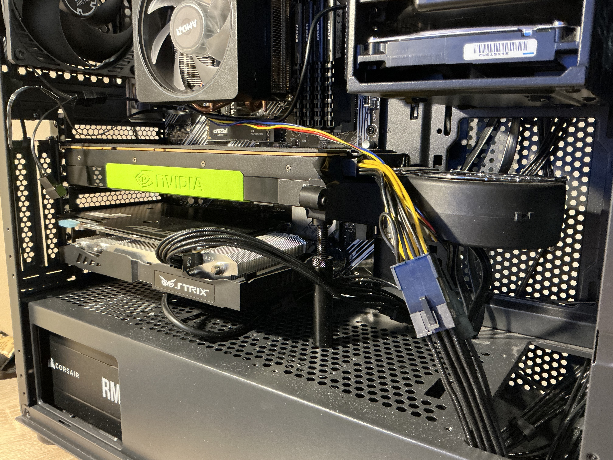
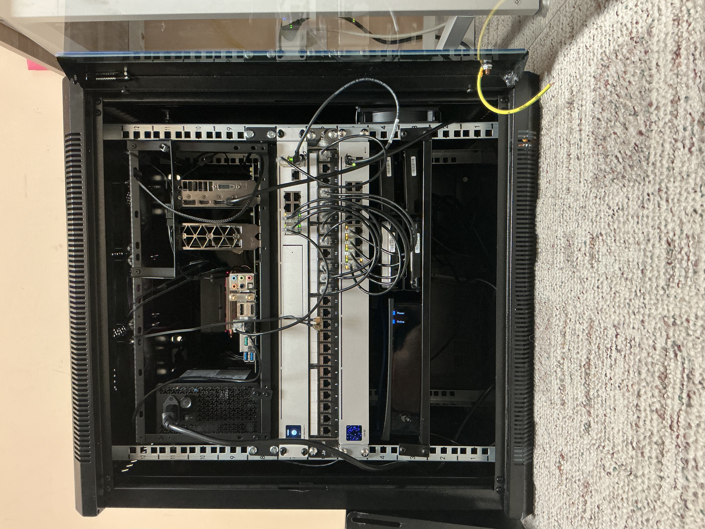

# Why I bought a sub-$100 Tesla P100

**Status:** draft  
**Lab:** ENDOR  
**Date:** 2026-09-07

A Tesla P100 16 GB was the cheapest enterprise-grade GPU I could find that still had encoding cores, and it was under $100.

The order was placed 2025-12-27. The board landed 2026-01-02. Part `699-2H400-0201`. Item price **$89.97**; order total **$93.77**. Seller, tracking, and the rest of the eBay page stay off this repo.

I use those cores when I game through Wolf / Moonlight. Immich and Jellyfin can still see the same card. Daily media playback is Infuse, not Jellyfin's own client.

## The claim

**Observed:** ENDOR runs a Tesla P100 16 GB as `nvidia0` / `/dev/dri/renderD128`. Wolf justified the card. `immich_machine_learning` is healthy as of later 2026-09-07 after the HealthCmd quoting fix. Healthy is a container status, not a smart-search benchmark.

**Documented (NVIDIA):** Pascal GP100 has NVENC/NVDEC. H.264 and HEVC exist; AV1 does not. Tesla-class cards are not under the consumer NVENC session cap.

**Not claimed:** stream counts, Moonlight lag numbers, or encode quality vs a 30-series.

## Cooling

The card is passive. ENDOR is a desktop board in a 12U rack tray. Air comes from a custom 3D-printed shroud and a Wathai 97x33 mm 9733 12 V 4-pin PWM centrifugal blower.

The close-up photo is the old tower. The rack photo is current. The old-tower shot also shows an ASUS Strix under the P100; that is not added to the running GPU list.

A system service maps `nvidia-smi` temp onto motherboard PWM `hwmon1/pwm3`. Copies: [configs/p100/](../configs/p100/).

| GPU temp | PWM |
| --- | --- |
| <= 45 C | 50 (stall floor) |
| 45-50 C | ramp 50 to 80 |
| 50-75 C | ramp 80 to 255 |
| >= 75 C | 255 |

Three failed nvidia-smi reads, or SIGINT/SIGTERM, pin the fan at 255. systemd restarts the unit. `After=network.target` is what is on disk; the script needs the NVIDIA module, not a default route.

## Related

- [What ENDOR is](what-endor-is.md)
- [Why I run Wolf on Podman](why-i-run-wolf-on-podman.md)
- [Wolf Quadlet](../configs/wolf/wolf.container)
- [Immich](../configs/immich/)
- [P100 fan service](../configs/p100/)
